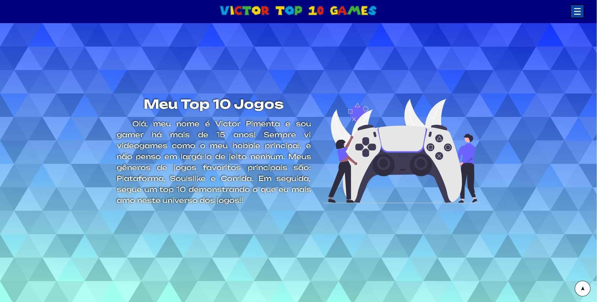
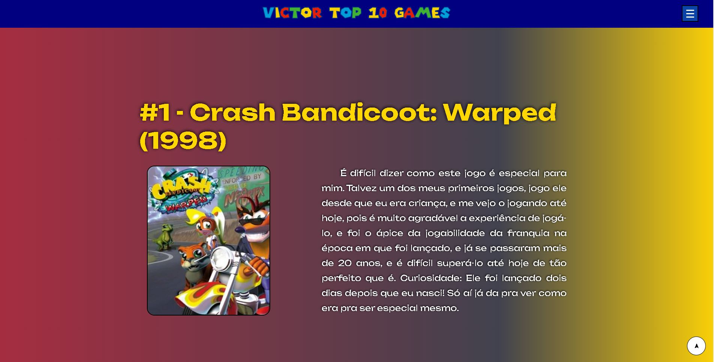

<h1 align="center"> Projeto Top Games </h1>

Projeto criado para aplicação de Landing Page, para listar os meus jogos favoritos, avaliados por mim (Victor Pimenta).

<a href="#tecnologias">Tecnologias</a>&nbsp;&nbsp;&nbsp;|&nbsp;&nbsp;&nbsp;
<a href="#projeto">Projeto</a>

 

Imagem da home da página (Imagem 1).

 

Imagem da descrição de um dos jogos (Imagem 2).

## Tecnologias

Esse projeto foi desenvolvido com as seguintes tecnologias:

- HTML e CSS
- Git e Github

## Projeto

O Projeto Top Games é um projeto de página de Landing Page, que lista os melhores jogos avaliados pelo autor, com menu de seleção, cada um deles equivalente a um dos jogos do ranking. Além disso, foi utilizado ferramentas como display flex e grid, para disposição dos elementos na página, além de responsividade com dispositivos móveis.

---

Projeto realizado por Victor Pimenta. [LinkedIn](https://www.linkedin.com/in/victor-cardoso-pimenta-0250371a0/)